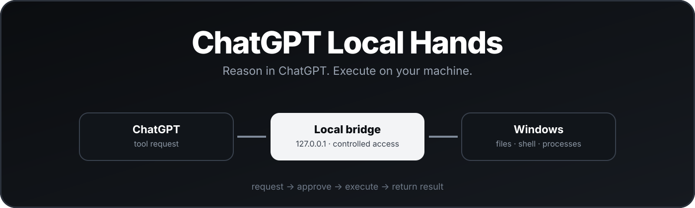
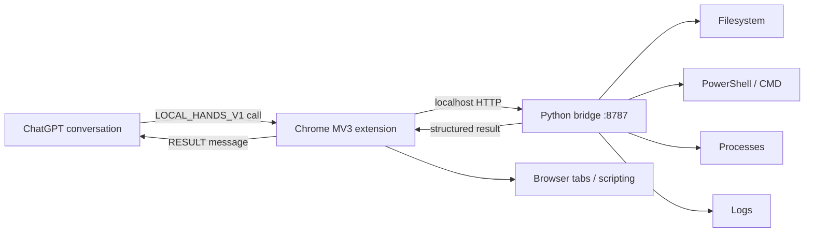

<p align="center">
  
</p>

<div align="center">

# ChatGPT Local Hands

**Give regular ChatGPT controlled access to your local Windows machine.**

Chrome extension → localhost bridge → filesystem, shell, processes, logs and browser actions.


[](https://github.com/mikhail494/chatgpt-local-hands/actions/workflows/ci.yml)

[Quick start](#quick-start) · [Safety model](#safety-model) · [Protocol](PROTOCOL.md) · [Security](SECURITY.md) · [Tests](#tests)

</div>

---

## What it is

**ChatGPT Local Hands** is a lightweight local execution layer for `chatgpt.com`.

A Chrome MV3 extension watches completed assistant messages for a strict `LOCAL_HANDS_V1` tool block. It forwards approved local operations to a Python bridge bound to `127.0.0.1`, executes them on your machine, then sends the structured result back into the same ChatGPT conversation.

The model stays in the normal ChatGPT browser tab. You do **not** need an OpenAI API key, a custom LLM client, Selenium/CDP, or a second browser session.

## Architecture



## Local tool surface

```text
fs.read        fs.list        fs.stat
fs.write       fs.patch       fs.mkdir
fs.move        fs.copy        fs.delete
shell.powershell             shell.cmd
process.list   process.start  process.kill
file.tail
```

The extension also exposes selected `browser.*` actions through Chrome APIs.

See [`PROTOCOL.md`](PROTOCOL.md) for the full wire format and exact schemas.

## Quick start

### 1. Create your config

```powershell
Copy-Item config.example.json config.json
```

Edit `config.json` and set `allowed_roots` to the directories ChatGPT may access.

### 2. Start the bridge

```bat
START_LOCAL_HANDS.bat
```

Check it with:

```bat
STATUS_LOCAL_HANDS.bat
```

### 3. Load the extension

1. Open `chrome://extensions`.
2. Enable **Developer mode**.
3. Click **Load unpacked**.
4. Select the repository's `extension` directory.

### 4. Initialize a ChatGPT conversation

Open the extension popup in a ChatGPT tab and click **Initialize current chat**.

The extension inserts the Local Hands capability schema into that conversation. After that, ChatGPT can request supported local actions and receive the results directly in chat.

## Permission modes

| Mode | Filesystem | Shell / process |
|---|---|---|
| `safe` | Read-only inside `allowed_roots` | Disabled |
| `workspace_full_access` | Read/write inside `allowed_roots` | Controlled by feature flags |
| `full_pc_access` | Unrestricted filesystem | Controlled by feature flags |

**Safe is the default.** Expand permissions only when you understand the consequences.

Path validation uses canonical resolved paths, so traversal attempts, symlinks and junctions cannot silently escape a restricted root.

## Safety model

- Bridge binds strictly to `127.0.0.1`.
- No wildcard LAN listener.
- Filesystem access can be constrained to configured roots.
- Shell and process-control capabilities can be disabled independently.
- The extension executes only from completed assistant turns, never user messages.
- Request IDs are deduplicated in both extension and bridge.
- The popup includes an **Emergency STOP**.
- Oversized output spills to local files instead of flooding the conversation.

Read [`SECURITY.md`](SECURITY.md) before enabling broad permissions.

> Localhost-only is not the same as zero-risk. Any local software able to reach the bridge may be able to invoke enabled capabilities. Treat broad modes as privileged access.

## Emergency stop

Use **Emergency STOP** in the extension popup to pause tool processing and clear the pending queue.

To stop the bridge itself:

```bat
STOP_LOCAL_HANDS.bat
```

## Tests

```powershell
python tests\test_bridge.py
```

The test suite covers bridge binding, filesystem operations, shell/process behavior, batching, idempotency, malformed requests and path-traversal protection.

## Project layout

```text
chatgpt-local-hands/
├─ bridge.py
├─ config.example.json
├─ PROTOCOL.md
├─ SECURITY.md
├─ START_LOCAL_HANDS.bat
├─ STATUS_LOCAL_HANDS.bat
├─ STOP_LOCAL_HANDS.bat
├─ extension/
│  ├─ manifest.json
│  ├─ background.js
│  ├─ content.js
│  ├─ popup.html
│  ├─ popup.css
│  └─ popup.js
└─ tests/
   └─ test_bridge.py
```

## Troubleshooting

**Extension says Disconnected**  
Run `STATUS_LOCAL_HANDS.bat`. If the bridge is stopped, start it with `START_LOCAL_HANDS.bat` and reload the extension.

**Port 8787 is already in use**  
Stop the existing bridge with `STOP_LOCAL_HANDS.bat`, then start it again.

**Chat shows a DOM error**  
ChatGPT's page structure may have changed. Update selectors in `extension/content.js`, reload the unpacked extension and resume processing.

**A result is truncated**  
Large results are written under `output/`; the chat receives a compact head/tail plus the local output path.

## Status

Experimental and unofficial. Browser UI changes can require extension updates. This project is not affiliated with OpenAI or Google.

---

<div align="center">
<sub>Reasoning stays in ChatGPT. Execution stays on your machine.</sub>
</div>
